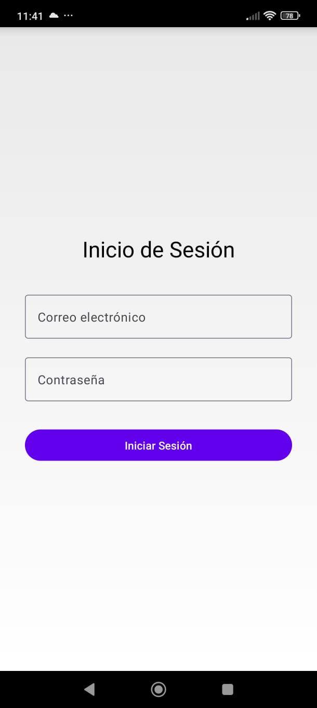
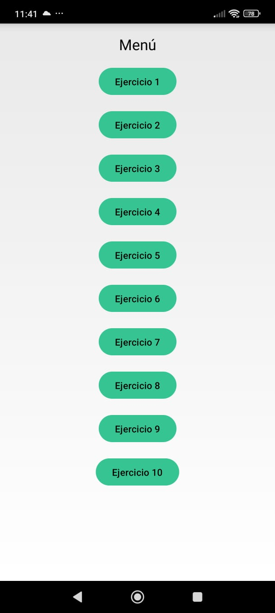
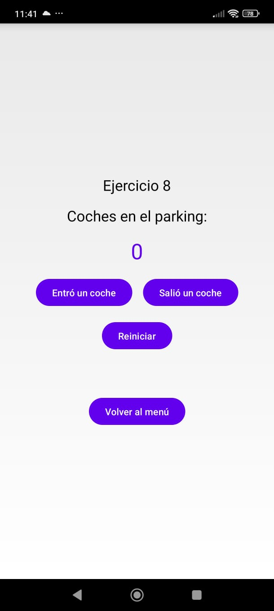

# Aplicacion-Android
Aplicacion movil trabajada en Android Studio
----------------------------------------

**Uso**
--------------------------------------
La aplicacion cuenta con un login y sus propias validaciones como lo son leer correctamente un gmail, un .com y los @.
Tambien cuenta con validaciones en la zona de contraseñas, no se podra acceder al interior de la aplicacion si no se escribe la contraseña "tap*2025" correctamente

Una vez dentro, se desplegara un menú el cual contiene los botones con cada uno de los ejercicios trabajados en ellos.

Al acceder puedes probar el ejercicio con total comodidad, cada uno cuenta con un boton al final del ejercicio para volver al menú y seleccionar otro ejercicio

--------------------------------------------
**Elaborado por:**
- Leyva Solis Kaleb Daniel
- Mendoza Martinez Eduardo Yael
